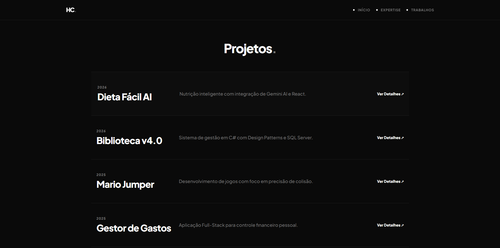
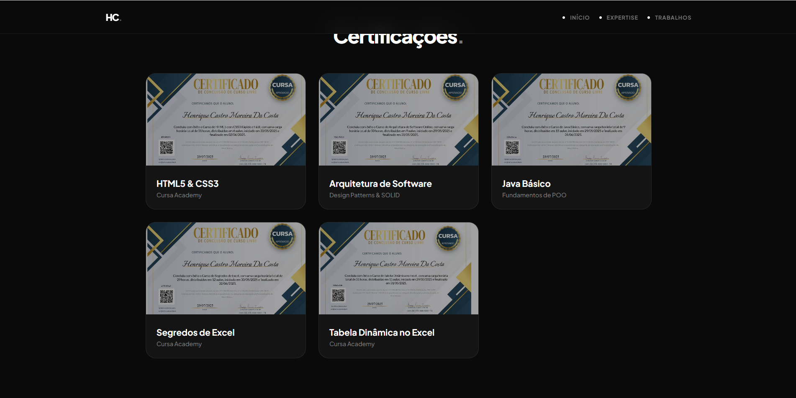
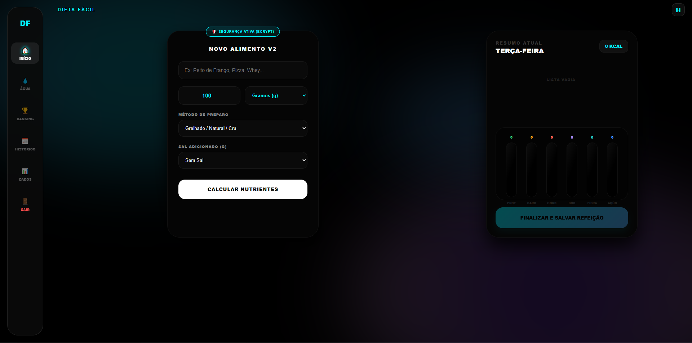
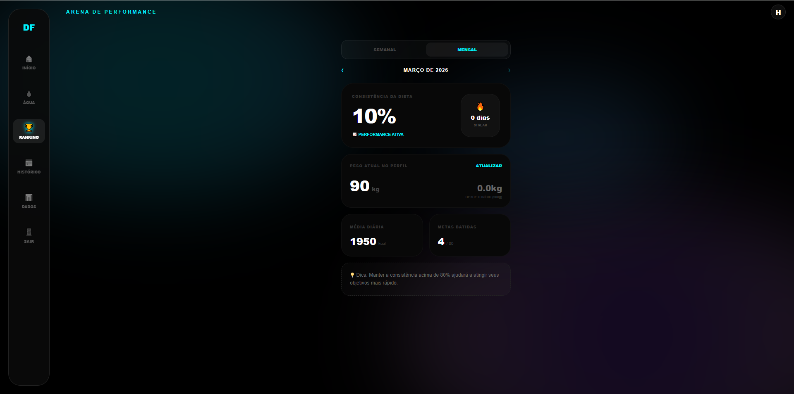

# 🚀 Portfólio Profissional | Henrique Castro

<div align="center">
  
  
  <p><strong>Engenharia de Software // 7º Semestre</strong></p>
  <p><em>Focado em sistemas de alta precisão e arquiteturas escaláveis.</em></p>

  <p>
    <a href="https://github.com/HenriqueCastro18">
      
    </a>
    <a href="https://www.linkedin.com/in/henrique-castro-b13798345">
      
    </a>
  </p>
</div>

---

## 👤 Perfil e Habilidades


Apresentação técnica focada em **Back-End**, utilizando **Python** e **C#** para o desenvolvimento de arquiteturas sólidas. Especialista em aplicar **Design Patterns** (Singleton, Repository) e princípios **SOLID** em projetos acadêmicos e profissionais.

### **Expertise Técnica**
* **Back-End:** Python (Django), C# (.NET), Node.js.
* **Front-End:** React, TypeScript, HTML5 e CSS3 responsivo.
* **Integrações:** Gemini AI API e sistemas IoT com ESP32.

---

## 🎓 Certificações e Formação


Galeria técnica com foco em fundamentos de software e gestão de dados:
* **Arquitetura de Software:** Design Patterns & SOLID.
* **HTML5 & CSS3:** Estilização avançada e semântica.
* **Java Básico:** Fundamentos de Orientação a Objetos.
* **Excel:** Tabelas Dinâmicas e Gestão de Dados.

---

## 💻 Projetos em Destaque
O portfólio conta com uma navegação dinâmica que detalha cada repositório individualmente.

### **Dieta Fácil AI**
<div align="center">
  
  
</div>

* **Descrição:** Sistema de nutrição inteligente integrado à API do Gemini.
* **Stack:** React, Node.js e Gemini AI.

### **Outros Repositórios**
* **[Biblioteca v4.0](https://github.com/HenriqueCastro18/Biblioteca-v4.0):** Gestão em C# com SQL Server.
* **[Mario Jumper](https://github.com/HenriqueCastro18/Mario-Jumper---Cannon-Precision):** Foco em lógica de colisão e física.
* **[Gestor de Gastos](https://github.com/HenriqueCastro18/Gestor_Gastos):** Controle financeiro Full-Stack.

---

## ⚙️ Tecnologias do Portfólio
* **Three.js:** Visualização 3D interativa (`3D.glb`) controlada por `script.js`.
* **Vanilla JS:** Sistema de rotas dinâmicas via parâmetros de URL (`projeto.html?id=...`).
* **Design Responsivo:** Layout adaptável para Mobile e Desktop.

---

## 📂 Como Clonar este Repositório
```bash
# Clone o repositório
git clone [https://github.com/HenriqueCastro18/Portifoil.git](https://github.com/HenriqueCastro18/Portifoil.git)

# Acesse a pasta
cd Portifoil

# Execute o projeto
start index.html