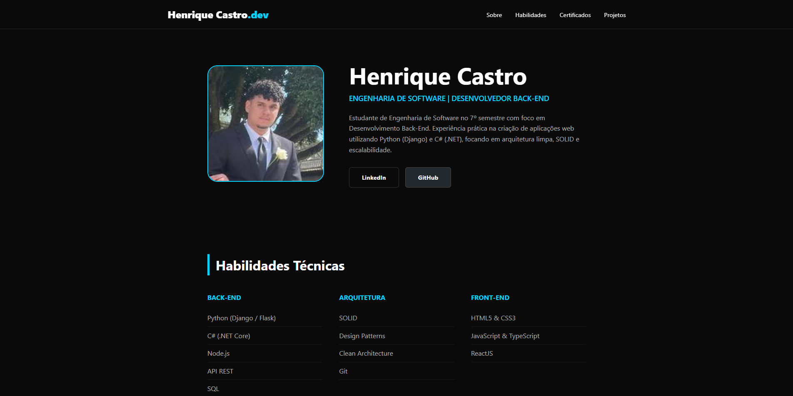
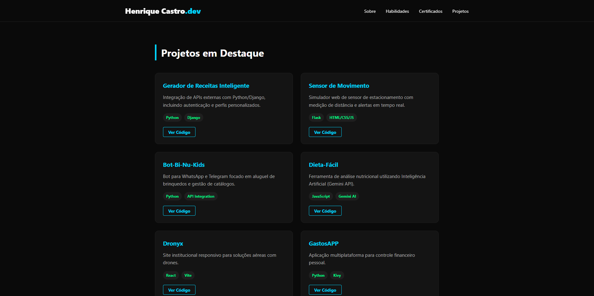
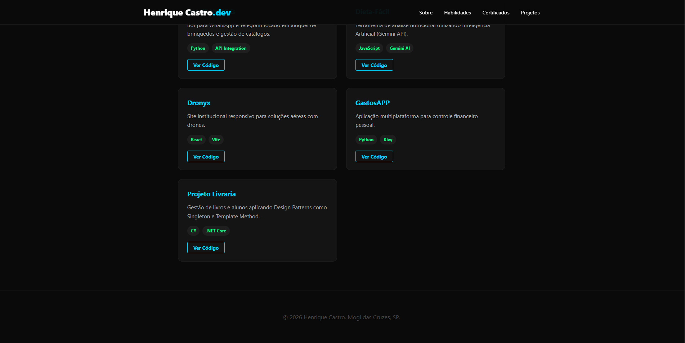

# 🚀 Portfólio Profissional | Henrique Castro

Este é o meu portfólio pessoal, desenvolvido para consolidar minha trajetória na Engenharia de Software e destacar minhas competências em desenvolvimento **Back-End**. O projeto foca em uma interface moderna, intuitiva e totalmente responsiva.

## 👤 Perfil e Habilidades

Apresentação profissional e divisão de tecnologias por categorias (Back-End, Arquitetura e Front-End).

## 🛠️ Tecnologias e Boas Práticas
* **HTML5 & CSS3**: Estrutura semântica e estilização avançada com variáveis globais.
* **Design Responsivo**: Layout que se adapta a dispositivos móveis e desktops.
* **Clean Code**: Código organizado, modular e de fácil manutenção.
* **Padrões de Projeto**: Implementação de conceitos como SOLID e Design Patterns.

## 🎓 Certificações e Formação

Galeria de certificados com imagens otimizadas em tamanho 120px e uso de `object-fit: contain` para garantir visibilidade total sem cortes.

## 💻 Projetos em Destaque
<p align="center">
  
  
</p>

Exibição dos meus principais trabalhos, incluindo links diretos para os repositórios e tecnologias utilizadas.

---

## 📂 Como Clonar este Repositório

```bash
# Clone o repositório
git clone [https://github.com/HenriqueCCastro/seu-repositorio.git](https://github.com/HenriqueCCastro/seu-repositorio.git)

# Acesse a pasta do projeto
cd seu-repositorio

# Abra o index.html no seu navegador
